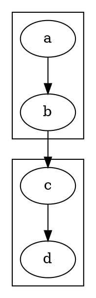
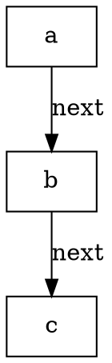
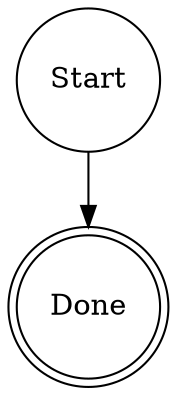

<!-- ABOUTME: Complete DOT pipeline reference for smasher-attractor. -->
<!-- ABOUTME: Documents node shapes, attributes, edge semantics, DOT syntax, and stylesheets. -->

# DOT Pipeline Reference

Smasher pipelines are standard DOT digraphs. The engine determines each node's
behavior from its `shape` attribute. This document covers all supported shapes,
attributes, edge semantics, and stylesheets.

## Node Shapes

The `shape` attribute on a DOT node determines its semantic type:

| Shape            | Node Type     | Purpose                                  |
|------------------|---------------|------------------------------------------|
| `circle`         | Start         | Pipeline entry point                     |
| `point`          | Start         | Alternative start marker                 |
| `Mdiamond`       | Start         | Alternative start marker                 |
| `doublecircle`   | Exit          | Pipeline terminal node                   |
| `Msquare`        | Exit          | Alternative exit marker                  |
| `diamond`        | Conditional   | Branch based on variable conditions      |
| `box`            | Codergen      | Run an LLM agent session                 |
| `rectangle`      | Codergen      | Alternative codergen marker              |
| `parallelogram`  | Tool          | Execute a registered tool                |
| `hexagon`        | Interviewer   | Human interaction node                   |
| `oval`           | Interviewer   | Alternative interviewer marker           |
| `ellipse`        | Interviewer   | Alternative interviewer marker           |
| `component`      | Parallel      | Fan-out concurrent execution             |
| `tripleoctagon`  | FanIn         | Join parallel branches                   |
| `house`          | Manager       | Coordinator node                         |
| `folder`         | SubPipeline   | Nested DOT file                          |
| *(any other)*    | Generic       | Passthrough processing node              |

A node with no `shape` at all is Codergen. The mapping lives in
`node_type_from_shape` (`crates/smasher-attractor/src/graph/mod.rs`).

### Start (circle / point / Mdiamond)

Entry point for the pipeline. Every pipeline must have exactly one Start node.

```dot
start [shape=circle, label="Begin"];
```

### Exit (doublecircle / Msquare)

Terminal node. The pipeline stops when it reaches an Exit node. A pipeline can
have multiple Exit nodes for different outcomes.

```dot
done [shape=doublecircle, label="Success"];
failed [shape=doublecircle, label="Failed"];
```

### Conditional (diamond)

Evaluates a condition expression against the pipeline context. Routes along
outgoing edges labeled `success` or `failure`.

```dot
check [shape=diamond, label="Check Status", condition="status=ready"];
```

### Codergen (box / rectangle)

Runs an LLM agent session. The agent receives the `prompt` attribute as its
system instruction and uses the `model` attribute to select the LLM.

```dot
generate [
    shape=box,
    label="Generate Code",
    model="claude-sonnet-5",
    prompt="Write clean, tested code following the plan."
];
```

### Tool (parallelogram)

Executes a registered tool. The tool name is determined by the `tool` attribute,
falling back to the node's label.

```dot
lint [shape=parallelogram, tool="linter", args="{\"strict\": true}"];

// Or using label as the tool name:
lint [shape=parallelogram, label="linter"];
```

### Interviewer (hexagon / oval / ellipse)

Human interaction node. Pauses the pipeline and asks the user a question.
Supports free-form input, predefined options, and yes/no approval.

```dot
ask_user [shape=hexagon, label="What should we name this?", question="Pick a name"];
```

### Parallel (component)

Fan-out node that dispatches downstream branches concurrently.

```dot
fan_out [shape=component, label="Fan Out", max_concurrency=3];
```

### FanIn (tripleoctagon)

Join node that collects the results of parallel branches.

```dot
join [shape=tripleoctagon, label="Join"];
```

### Manager (house)

Human gate / coordinator node. Similar to Interviewer but designed for
approval workflows. Reads the `question` attribute and presents it to the
operator.

```dot
gate [shape=house, label="Approval Gate", question="Do you approve?"];
```

### SubPipeline (folder)

References an external DOT file for inline composition.

### Generic (any other shape)

Passthrough processing node. Executes with whatever handler is registered for
the Generic type.

## DOT Language Syntax

Smasher uses a purpose-built recursive descent parser for the DOT language. The
supported subset includes:

### Graph Declaration

```dot
digraph PipelineName {
    // nodes and edges go here
}
```

The `strict` keyword is accepted but has no effect:

```dot
strict digraph PipelineName { ... }
```

Both `digraph` and `graph` keywords are accepted.

### Attribute Values

DOT attribute values support four types via automatic coercion:

| Type | Examples | Notes |
|------|----------|-------|
| String | `"hello"`, `"claude-sonnet-5"` | Quoted text |
| Number | `42`, `3.14` | Integer or floating-point |
| Duration | `"100ms"`, `"900s"`, `"5m"`, `"2h"` | Quoted string with unit suffix |
| Bool | `"true"`, `"false"` | Quoted strings coerced to boolean |

Duration values are automatically parsed when the string matches the pattern
`<number><suffix>` where suffix is one of `ms`, `s`, `m`, or `h`.

### Subgraphs

Subgraphs are supported for grouping nodes:



### Node and Edge Defaults

Default attributes for all nodes or edges can be set:



## Node Attributes

All nodes support these common attributes:

| Attribute              | Type     | Description                                          |
|------------------------|----------|------------------------------------------------------|
| `label`                | string   | Display name shown in logs and prompts               |
| `class`                | string   | Space-separated class names for stylesheet matching  |

### Codergen Attributes

| Attribute              | Type     | Description                                          |
|------------------------|----------|------------------------------------------------------|
| `model`                | string   | LLM model identifier (e.g. `"claude-sonnet-5"`) |
| `prompt`               | string   | System instruction for the agent                     |

### Conditional Attributes

| Attribute              | Type     | Description                                          |
|------------------------|----------|------------------------------------------------------|
| `condition`            | string   | Expression evaluated against context (see below)     |

### Tool Attributes

| Attribute              | Type     | Description                                          |
|------------------------|----------|------------------------------------------------------|
| `tool`                 | string   | Name of the tool to invoke (falls back to label)     |
| `args`                 | string   | JSON-encoded arguments for the tool                  |

### Manager Attributes

| Attribute              | Type     | Description                                          |
|------------------------|----------|------------------------------------------------------|
| `task`                 | string   | Description of the task to coordinate (falls back to label) |
| `config`               | string   | JSON-encoded configuration for the manager           |

### Retry Attributes

Any node can have retry behavior:

| Attribute              | Type     | Description                                          |
|------------------------|----------|------------------------------------------------------|
| `retries`              | number   | Number of retries (total attempts = retries + 1)     |
| `retry_delay`          | duration | Base delay between retries (e.g. `"1s"`, `"500ms"`) |
| `max_retry_delay`      | duration | Upper bound on exponential backoff                   |
| `retry_jitter`         | boolean  | Randomize delay to avoid thundering herd             |

### Interviewer / Manager Attributes

| Attribute              | Type     | Description                                          |
|------------------------|----------|------------------------------------------------------|
| `question`             | string   | The question presented to the human                  |
| `prompt`               | string   | Alternative to `question` (Manager nodes)            |
| `options`              | string   | Comma-separated predefined choices                   |
| `approve`              | boolean  | If true, use yes/no approval mode                    |
| `human.timeout_secs`   | number   | Seconds to wait before timing out                    |
| `human.default_choice` | string   | Response to use when the interaction times out        |

### Parallel Attributes

| Attribute              | Type     | Description                                          |
|------------------------|----------|------------------------------------------------------|
| `max_concurrency`      | number   | Limit on concurrent branches (default: 10)           |
| `fail_fast`            | boolean  | Abort all branches on first failure                  |

## Edge Attributes

Edges control routing between nodes after execution.

| Attribute              | Type     | Description                                          |
|------------------------|----------|------------------------------------------------------|
| `label`                | string   | Outcome label for routing (see below)                |
| `condition`            | string   | Expression evaluated to determine if edge is taken   |
| `priority`             | number   | When multiple edges match, highest priority wins     |
| `loop_restart`         | boolean  | If true, traversing this edge restarts the target node |

### Edge Label Routing

Edge labels determine which outgoing path is taken after a node executes:

- **Success labels**: `success`, `yes`, `true` match successful outcomes
- **Failure labels**: `failure`, `error`, `no`, `false` match failure outcomes
- **Priority**: When multiple edges match, the one with the highest `priority`
  attribute wins (default priority is 0)

```dot
check -> happy [label="success"];
check -> sad   [label="failure"];
```

### Loop Restart

When an edge has `loop_restart=true`, traversing it:

1. Resets node-specific context entries for the target node
2. Increments an internal loop counter
3. Re-enters the target node for another iteration

This is distinct from the retry mechanism (which re-runs a node on transient failure).
Loop restarts are explicit graph-level iteration driven by conditional routing.

```dot
check -> process [label="failure", loop_restart=true];
```

The engine's `max_steps` limit (default 1000) prevents infinite loops.

## Condition Expressions

Conditional nodes and edge conditions evaluate expressions against the pipeline context.

### Operators

| Syntax               | Meaning                                     |
|----------------------|---------------------------------------------|
| `key=value`          | Equality: variable `key` equals `value`     |
| `key!=value`         | Inequality: variable `key` does not equal `value` |
| `key>N`              | Greater than: variable `key` is numerically > N |
| `key<N`              | Less than: variable `key` is numerically < N |
| `a=b && c=d`         | Logical AND: both conditions must be true   |
| `a=b \|\| c=d`      | Logical OR: at least one must be true       |
| `!condition`         | Logical NOT: inverts the condition          |
| `(grouped)`          | Parentheses for precedence                  |

### Examples

```dot
// Simple equality
check [shape=diamond, condition="status=ready"];

// Compound condition
gate [shape=diamond, condition="auth=valid && quota=ok"];

// Numeric comparison
limit [shape=diamond, condition="count>10"];
```

## Stylesheets

Stylesheets modify graph node attributes before execution, allowing you to override
properties without editing the DOT file. They use a CSS-like syntax.

### Selectors

| Selector     | Matches                                          | Specificity |
|--------------|--------------------------------------------------|-------------|
| `*`          | All nodes                                        | 0 (lowest)  |
| `codergen`   | All nodes of that type                           | 1           |
| `.classname` | Nodes with matching `class` attribute            | 2           |
| `#node_id`   | The specific node with that ID                   | 3 (highest) |

### Value Types

| Type     | Examples                              |
|----------|---------------------------------------|
| String   | `"claude-sonnet-5"`          |
| Number   | `4096`, `0.7`                         |
| Boolean  | `true`, `false`                       |
| Duration | `30s`, `5m`, `2h`                     |

### Syntax

```css
/* Apply to all codergen nodes */
codergen {
    model: "claude-sonnet-5";
    max_tokens: 4096;
}

/* Apply to a specific node by ID */
#code_gen_1 {
    model: "claude-opus-4-20250514";
    temperature: 0.9;
}

/* Apply to nodes with a class */
.critical {
    retries: 3;
    retry_delay: 2s;
}

/* Apply to all nodes */
* {
    temperature: 0.5;
}
```

### Specificity Cascade

When multiple rules match a node, declarations are merged with higher-specificity
selectors overriding lower ones. Within the same specificity level, later rules
override earlier ones.

Order of precedence (lowest to highest):

1. `*` (wildcard)
2. Node type (e.g. `codergen`)
3. Class (e.g. `.critical`)
4. ID (e.g. `#code_gen_1`)

### Comments

Block comments are supported:

```css
/* This is a comment */
codergen {
    model: "claude-sonnet-5"; /* inline comment */
}
```

### Usage

Save your stylesheet to a file and pass it via `--stylesheet`:

```bash
smasher run pipeline.dot --stylesheet overrides.css
```

## Pipeline Output

The `smasher run` command prints the final pipeline context as pretty-printed JSON
to stdout. All variables (both input via `--var` and those set during execution) are
included.

## CLI Flags for `smasher run`

| Flag                  | Description                                         |
|-----------------------|-----------------------------------------------------|
| `<PIPELINE>`          | Path to the DOT pipeline file (positional, required) |
| `--var KEY=VALUE`     | Set a context variable (repeatable)                  |
| `--model MODEL`       | Model for codergen nodes (default: `claude-sonnet-5`) |
| `--max-steps N`       | Max node visits before forced stop (default: 1000)   |
| `--stylesheet PATH`   | Path to a stylesheet file for graph transforms       |

## Minimal Pipeline Template



Save this as `pipeline.dot` and run:

```bash
smasher run pipeline.dot
```
