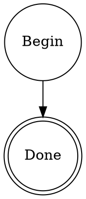
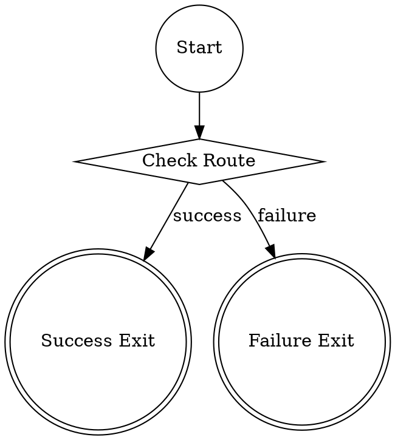
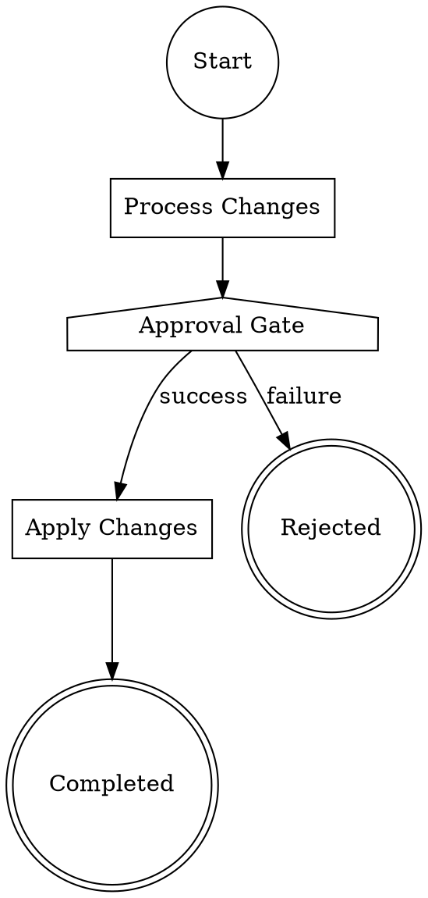

<!-- ABOUTME: Quickstart guide covering installation, one-shot completions, chat, pipelines, and human input. -->
<!-- ABOUTME: Walks new users from zero to running pipelines with variables and human-in-the-loop gates. -->

# Smasher Quickstart Guide

Get up and running with smasher in five minutes.

## Prerequisites

### Rust Toolchain

Smasher requires **Rust 1.85+** (edition 2024). Install via [rustup](https://rustup.rs/) if you
don't have it:

```bash
curl --proto '=https' --tlsv1.2 -sSf https://sh.rustup.rs | sh
```

Verify your toolchain version:

```bash
rustc --version
# rustc 1.85.0 or later
```

### API Keys

Smasher talks to LLM providers. You need at least one of the following environment variables set:

| Variable            | Provider   |
|---------------------|------------|
| `ANTHROPIC_API_KEY` | Anthropic (Claude models) |
| `OPENAI_API_KEY`    | OpenAI     |
| `GEMINI_API_KEY`    | Google Gemini |

You can export them directly:

```bash
export ANTHROPIC_API_KEY=sk-ant-...
```

Or create a `.env` file in the project root (smasher loads it automatically on startup):

```bash
# .env
ANTHROPIC_API_KEY=sk-ant-...
```

You can also point to a specific env file with the `--env-file` global flag:

```bash
smasher --env-file /path/to/secrets.env complete "Hello"
```

## Installation

Clone the repository and build in release mode:

```bash
git clone https://github.com/your-org/smasher.git
cd smasher
cargo build --release
```

The binary lands at `target/release/smasher`. Add it to your `PATH` or run it directly:

```bash
# Option A: add to PATH
export PATH="$PWD/target/release:$PATH"

# Option B: run directly
./target/release/smasher --help
```

Verify the installation:

```bash
smasher --version
```

You should see something like `smasher 0.1.0`.

## Your First Completion

The `complete` subcommand sends a one-shot prompt to an LLM and streams text deltas to stdout:

```bash
smasher complete "Explain the Rust ownership model in three sentences."
```

The response streams to your terminal in real time. When it finishes, a trailing newline is printed.

### Complete Options

```bash
# Choose a specific model (default: claude-sonnet-4-20250514)
smasher complete "Hello world" --model claude-sonnet-4-20250514

# Set a system prompt
smasher complete "Write a haiku" --system "You are a poetry expert."

# Get the full Response object as pretty-printed JSON (non-streaming)
smasher complete "Hello" --json

# Read the prompt from a file instead of the command line
smasher complete --file prompt.txt

# Control generation parameters
smasher complete "Hello" --max-tokens 100 --temperature 0.5
```

| Flag                   | Description                                           |
|------------------------|-------------------------------------------------------|
| `<PROMPT>`             | Positional prompt text. Omit if using `--file`.       |
| `--file <PATH>`        | Read the prompt from a file instead.                  |
| `--model <MODEL>`      | Model identifier (default: `claude-sonnet-4-20250514`). |
| `--max-tokens <N>`     | Maximum tokens to generate.                           |
| `--temperature <FLOAT>`| Sampling temperature (0.0 - 2.0).                    |
| `--system <TEXT>`      | System prompt to prepend.                             |
| `--json`               | Output the full Response as pretty-printed JSON.      |

## Interactive Chat

The `chat` subcommand starts an interactive REPL with tool access:

```bash
smasher chat
```

This opens a multi-turn conversation session with an LLM agent that has access to tools (file
reading, shell execution, etc.). The session displays a `>` prompt. Type your messages and press
Enter. The agent's response prints after each turn.

To exit the session, type `exit`, `quit`, or `/quit`, or press Ctrl+D (EOF).

When the session ends, smasher prints a usage summary to stderr showing total turns, input tokens,
and output tokens.

### Chat Options

```bash
# Specify a model
smasher chat --model claude-sonnet-4-20250514

# Set a custom working directory for tool operations
smasher chat --working-dir ./my-project

# Limit the maximum number of agentic turns
smasher chat --max-turns 50

# Override the system prompt
smasher chat --system "You are a Rust expert. Only give Rust examples."
```

| Flag                    | Description                                            |
|-------------------------|--------------------------------------------------------|
| `--model <MODEL>`       | Model identifier (default: `claude-sonnet-4-20250514`). |
| `--max-turns <N>`       | Maximum agentic turns (default: 100).                  |
| `--system <TEXT>`       | System prompt override.                                |
| `--working-dir <PATH>` | Working directory for tool operations.                 |

Tool call progress is shown on stderr. You'll see lines like:

```
[tool] read_file...
[tool] read_file ok (42ms)
```

## Running a Pipeline

Smasher pipelines are defined as [DOT digraphs](https://graphviz.org/doc/info/lang.html). The
`run` subcommand parses, resolves, and executes them. The final pipeline context is printed to
stdout as JSON.

### Minimal Example

Run the simplest possible pipeline (start node to exit node):

```bash
smasher run examples/old-examples/hello-world.dot
```

The `hello-world.dot` file looks like this:



The engine determines each node's role from its `shape` attribute:

| Shape            | Node Type     | Purpose                                  |
|------------------|---------------|------------------------------------------|
| `circle`         | Start         | Pipeline entry point                     |
| `point`          | Start         | Alternative start marker                 |
| `doublecircle`   | Exit          | Pipeline terminal node                   |
| `diamond`        | Conditional   | Branch based on variable conditions      |
| `box`            | Codergen      | Run an LLM agent session                 |
| `rectangle`      | Codergen      | Alternative codergen marker              |
| `hexagon`        | Tool          | Execute a tool                           |
| `oval`           | Interviewer   | Human interaction node                   |
| `ellipse`        | Interviewer   | Alternative interviewer marker           |
| `parallelogram`  | Parallel      | Fan-out concurrent execution             |
| `house`          | Manager       | Coordinator node                         |
| `component`      | SubPipeline   | Nested pipeline reference                |
| *(anything else)*| Generic       | Passthrough processing node              |

### Run Options

| Flag                  | Description                                                  |
|-----------------------|--------------------------------------------------------------|
| `<PIPELINE>`          | Path to the DOT pipeline file (positional, required).        |
| `--var KEY=VALUE`     | Set a context variable (repeatable).                         |
| `--model <MODEL>`     | Model for codergen nodes (default: `claude-sonnet-4-20250514`). |
| `--max-steps <N>`     | Max node visits before forced stop (default: 1000).          |
| `--stylesheet <PATH>` | Apply a stylesheet for graph transforms.                    |

## Supplying Variables

Variables are key-value pairs injected into the pipeline context before execution. Pass them with
the `--var` flag (repeatable):

```bash
# Single variable
smasher run examples/old-examples/conditional.dot --var route=yes

# Multiple variables
smasher run examples/old-examples/multi-step.dot --var auth=valid --var quota=ok
```

Variables must use `KEY=VALUE` format. If the `=` is missing, smasher exits with an error.

### How Variables Drive Conditional Routing

Inside a DOT file, conditional nodes (`shape=diamond`) have a `condition` attribute that is
evaluated against the pipeline context:



Running this pipeline with different variable values changes the execution path:

```bash
# Takes the "success" edge (route equals "yes")
smasher run examples/old-examples/conditional.dot --var route=yes

# Takes the "failure" edge (route does not equal "yes")
smasher run examples/old-examples/conditional.dot --var route=no
```

Supported condition operators:

- `key=value` -- equality
- `key!=value` -- inequality
- `key>N` -- greater than (numeric)
- `key<N` -- less than (numeric)
- `a=b && c=d` -- logical AND
- `a=b || c=d` -- logical OR
- `!condition` -- logical NOT
- `(grouped)` -- parentheses for precedence

### The Model Variable

The `--model` flag is automatically injected as a `model` variable in the pipeline context, so
codergen nodes can reference it:

```bash
smasher run examples/old-examples/codergen.dot --var task="implement fibonacci" --model claude-sonnet-4-20250514
```

## Human Input

Smasher supports human-in-the-loop interaction through **Interviewer** and **Manager** nodes. When
the engine reaches one of these nodes, it pauses execution and prompts the operator for input.

### The Interviewer System

At the core is the `Interviewer` trait, which defines three interaction modes:

1. **Free-form questions** (`ask`) -- present a question, get an open text response.
2. **Multiple-choice questions** (`ask_with_options`) -- present numbered options, get a selection.
3. **Approval gates** (`approve`) -- present a yes/no question, get a boolean.

When running from the CLI, the `ConsoleInterviewer` implementation reads from stdin and writes
prompts to stdout.

### Human Gate in a Pipeline

Manager nodes (`shape=house`) model human approval gates. The `question` attribute provides the
prompt shown to the operator:



When the pipeline reaches `human_gate`, the operator sees:

```
Do you approve this change?
```

Their response is stored in the pipeline context under the node's ID and determines which
outgoing edge is followed (`success` or `failure`).

### Interviewer Nodes

Interviewer nodes (`shape=oval` or `shape=ellipse`) support richer interaction with attributes:

| Attribute   | Description                                          |
|-------------|------------------------------------------------------|
| `question`  | The question text (falls back to the node `label`).  |
| `options`   | Comma-separated choices for multiple-choice mode.    |
| `approve`   | Set to `true` for yes/no approval mode.              |

The response is stored in context as `_interview_{node_id}`.

### Multi-Stage Approval

Chain multiple Manager nodes for workflows requiring sign-off from different stakeholders:

```bash
smasher run examples/old-examples/multi-gate.dot
```

This pipeline presents a security review gate followed by a compliance check gate. Both must
approve before the pipeline proceeds.

### Timeout and Defaults

The free-form path of `InterviewerHandler` supports optional timeout and default responses.
Configure them via node attributes:

| Node Attribute          | Description                                              |
|-------------------------|----------------------------------------------------------|
| `human.timeout_secs`    | Seconds to wait before timing out (overrides handler default). |
| `human.default_choice`  | Response to use when the interview times out.            |

If a timeout fires and no default choice is configured, the node returns a failure outcome.

### Programmatic Interviewer Strategies

For automated testing or non-interactive use, smasher provides several `Interviewer`
implementations:

| Implementation            | Behavior                                              |
|---------------------------|-------------------------------------------------------|
| `AutoApproveInterviewer`  | Always approves; returns a configurable default text. |
| `QueueInterviewer`        | Pops pre-loaded responses from a FIFO queue.          |
| `CallbackInterviewer`     | Delegates to user-supplied closures.                  |
| `ConsoleInterviewer`      | Reads from stdin, writes prompts to stdout.           |
| `RecordingInterviewer`    | Wraps another interviewer and records all interactions.|
| `TimeoutInterviewer`      | Wraps another interviewer with a timeout.             |
| `HttpInterviewer`         | Queues questions for external HTTP clients via REST.  |

## Verbose Mode and Debugging

Enable debug-level logging to stderr with `-v`:

```bash
smasher -v run examples/old-examples/hello-world.dot
```

Or use the `RUST_LOG` environment variable for fine-grained control:

```bash
RUST_LOG=debug smasher run examples/old-examples/hello-world.dot
```

Without `-v`, only `warn`-level messages are shown on stderr.

## Exit Codes

| Code | Meaning                                    |
|------|--------------------------------------------|
| 0    | Success                                    |
| 1    | General error                              |
| 2    | LLM provider error                         |
| 3    | Agent session error                        |
| 4    | Pipeline engine error                      |
| 5    | Parse, resolution, or stylesheet error     |
| 6    | I/O error (file not found, etc.)           |

## Desktop App (macOS)

`smasher-desktop` wraps the web dashboard in a native Tauri window. On launch it
starts the `smasher-web` server in-process, waits until the port is bound, and
then opens the window on the `smasher-spa` dashboard. It adds native file
dialogs for exporting and importing `.dot` files, and an OS notification when a
pipeline completes or aborts.

**Prerequisites:** the Rust toolchain above, Node.js with npm, Xcode Command
Line Tools, and the Tauri CLI:

```bash
cargo install tauri-cli --version "^2"
(cd frontend && npm install)
```

**Development** (the window loads Vite on `127.0.0.1:5173`, so frontend edits
hot-reload; the embedded server uses the fixed port 21541 that Vite proxies to):

```bash
make desktop-dev          # = cd crates/smasher-desktop && cargo tauri dev
```

**Build a `.app`:**

```bash
make desktop-build        # = cd crates/smasher-desktop && cargo tauri build
open target/release/bundle/macos/Smasher.app
```

The bundle is machine-local: it serves the SPA build, examples, and design
kit from this checkout, so keep the repo where it was built.

**Data dir:** the app keeps runs, workflows, and settings in
`~/Documents/smasher` so they're easy to browse in Finder. Set
`SMASHER_DATA_DIR` to use another location. The CLI still defaults to
`~/.smasher`.

**LLM settings:** click the gear in the page header. There you set the
default model and provider, plus each provider's API key and base URL
(Anthropic, OpenAI, Gemini, Ollama). API keys are stored in the macOS
Keychain (service `com.smasher.desktop`). Everything else goes in
`~/Documents/smasher/settings.json`. Settings take effect when the app
restarts, and the modal has a **Restart now** button for that. For a local
Ollama, set its base URL to `http://localhost:11434` and leave the key
empty.

Saved settings override env vars. An app launched from Finder or the Dock
has no shell environment and a working directory of `/`, so it can't see
your shell exports or the repo's `.env`. It does still read
`~/Documents/smasher/.env` (or `$SMASHER_DATA_DIR/.env`) for anything the
modal doesn't set.

With no provider configured, the app still opens so you can reach Settings.
Runs fail until a provider is added. If the server can't bind its port, the
app shows a "Smasher couldn't start" dialog and exits.

**Loopback only:** the embedded server always binds `127.0.0.1`. It ignores
`SMASHER_WEB_HOST` and `SMASHER_WEB_PORT`. Release builds take an OS-assigned
port, debug builds use 21541. The API has no auth, so it is never reachable
from another machine.

## Next Steps

- [DOT Format Reference](dot-reference.md) -- node shapes, attributes, edge conditions, stylesheets
- [API Reference](api-reference.md) -- programmatic Rust API for all three crate layers
- [Example Pipelines](../examples/old-examples/README.md) -- annotated examples covering conditional, parallel, retry, and human gate patterns
- [smasher-llm](../smasher-llm/) -- unified LLM client library (OpenAI, Anthropic, Gemini)
- [smasher-agent](../smasher-agent/) -- programmable coding agent loop with tools and subagents
- [smasher-attractor](../smasher-attractor/) -- DOT-based directed graph pipeline orchestrator
