# Spec: SPA port repairs, batch 2

This spec covers the last four modules of
[`capability-map-spa-repairs.md`](capability-map-spa-repairs.md): `run-summary`,
`question-card`, `event-log` and `workflow-detail`. They share one spec, plan and todo, with one
section and one checkpoint per module. They restore the rest of what the HTMX → SPA port dropped
(`BACKLOG.md` #21).

`workflow-detail` goes last. It reuses `RunDialog` (from `run-launch`) and the run fields that
`run-summary` shows. The other three don't touch each other's files and can go in any order.

Old behaviour comes from the templates deleted in `0e5647c`
(`git show 0e5647c^:crates/smasher-web/<path>`). There's one exception: the event renderer was
deleted earlier, so its reference is `git show 0417f4d^:crates/smasher-web/src/sse.rs`
(`render_event_html`). By `0e5647c^` the HTMX page was already receiving raw JSON.

## Objective

Someone watching a run in the SPA should see what the old dashboard showed them:
- why a run failed;
- a pipeline graph whose node colours follow the run;
- a token total;
- questions they can read and answer without guessing;
- an event log they can scan at a glance.

Someone looking at one workflow should get a page for it: its source, its latest run and its run
history.

Everything is frontend only. The API already provides every field used here. If a module turns
out to need a Rust or API change, stop and ask.

---

## Module 1: `run-summary`

### Old vs now

**Run metadata.**
- **Old:** Completed, Working Directory and Error sat in the Telemetry drawer's "Run Metadata"
  `<dl>` (`run_detail_body.html:98-118`). Each row showed only when its field was set, the
  values were raw, and Error was red.
- **Now:** `RunDetail.svelte` shows none of them, although `run` is re-polled every 5s and
  already has them.
- **Server** (`smasher-web/src/state.rs:79-112`, `run_launch.rs:323-335`):
  - `completed_at` is RFC 3339, set for Completed, Failed and Aborted runs.
  - `run_working_dir` is shortened to `artifacts/<dir>`.
  - `error` is set only for Failed. A cancel gives Aborted with `error: null`.

**Pipeline graph.**
- **Old:** re-fetched on `load, every 3s` under "Pipeline Graph", and never stopped.
- **Old scaling:** CSS `svg { max-width: 100%; height: auto }` (`style.css:1056-1073`) shrank wide
  graphs to the container's width.
- **Old errors:** shown inline as red text. For a missing Graphviz, the message was:
  > Graphviz's \`dot\` command isn't installed, or isn't on PATH. Install it (e.g. \`brew install
  > graphviz\` on macOS, \`apt install graphviz\` on Debian/Ubuntu) and reload this page.
- **Now:**
  - Loaded once in `onMount` (`RunDetail.svelte:62-66`).
  - Every error is swallowed by an empty `catch` (`:39-48`).
  - The container scrolls instead of scaling.
- **Server** (`api.rs:537-578`):
  - A failed render is a 500 with `{"error":"internal error: graph render failed: graphviz not available: …"}`.
  - `errorFromResponse` puts that text into `Error.message`.
  - Every request runs `dot` again.

**Token counter.**
- **Old:** IN, OUT and TOTAL, polled every 3s.
- **Now:**
  - Input and output only, polled every 5s (`TokenCounter.svelte:10`). The comment at `:3`
    wrongly says the old counter was 5s.
  - It never stops polling.
  - `GET /api/runs/{id}/tokens` returns `{input_tokens, output_tokens}`.

**Run list.**
- **Old:** "unnamed" for a run with no graph name (`run_list.html:15`).
- **Now:**
  - `RunList.svelte:66` prints `graph_name` as-is, so the cell is blank.
  - The server sends `graph_name: string | null`, but `lib/api/runs.ts:16` types it as `string`.
  - An anonymous `digraph { … }` gives `null`. `digraph "" { … }` gives `""`.

### User stories and acceptance criteria

1. **A failed run says why.**
   - `RunDetail` shows a details list under the header with three rows:
     - Completed: `completed_at` as `toLocaleString()`, as `RunList` formats Started.
     - Working Directory: mono.
     - Error: in `text-destructive`, with the text wrapping.
   - Each row shows only when its field is non-null. A running run shows none of them.
   - The page-level `error` (failed to load the run) stays separate from `run.error` and keeps its
     own `role="alert"` line.
2. **The graph follows the run.**
   - The graph is fetched on mount, then every 3s while the run is `Running`.
   - When the run turns terminal, one more fetch runs and then polling stops, so the final node
     colours appear.
   - The markup is replaced only when the SVG text has changed.
   - The graph sits under a "Pipeline Graph" heading.
3. **Graph errors are visible.**
   - A failed graph fetch shows its message inline, in the graph's place, in `text-destructive`.
   - It doesn't toast, as on the old page. That also keeps `app-shell.spec.ts`'s count of 2
     toasts on a missing run.
   - If the message contains `graphviz not available`, the client shows the old install hint
     (wording above) instead.
   - Otherwise it shows the server's message.
   - A later successful fetch clears the error.
4. **Wide graphs fit.** The SVG scales down to the container's width (`max-width: 100%;
   height: auto`) and never needs horizontal scrolling. Narrow graphs aren't scaled up.
5. **The token counter has a total and keeps pace.**
   - It shows `Input tokens`, `Output tokens` and `Total tokens`, where the total is input plus
     output.
   - Numbers use `toLocaleString()`.
   - It polls every 3s while the run is active, fetches once more when it turns terminal, then
     stops. `RunDetail` passes an `active` prop, since the counter has no status of its own.
   - Its errors keep going through the existing inline line.
6. **Runs with no name read "unnamed".**
   - `RunList` shows `unnamed` (muted) when `graph_name` is null, empty or whitespace.
   - The TS type becomes `graph_name: string | null`.

### Out of scope

- Run ID and Started as rows in the details list. The header already shows the run id, and
  `RunList` shows Started.
- Caching graph renders on the server.
- Renaming `RunList`'s "Workflow" column back to "Graph".

---

## Module 2: `question-card`

### Old vs now

**Old card** (`question_card.html`):
- A header with the kind as an uppercase pill (`Free Form`, `Multiple Choice`, `Approval`) and
  the full question id in muted mono.
- The question text.
- Unselected radio buttons for multiple choice.
- A text input for everything else, including approval.
- A Submit button.
- "No pending questions." when the list was empty.
- It waited 2s before its first fetch (`every 2s` with no `load`), so starting straight away is
  an improvement, not a restoration.
- The old form was probably broken:
  - it posted form-encoded data to a JSON endpoint;
  - its radios sat outside the `<form>`.

  So this spec describes the intended behaviour, not a literal port.

**Now:**
- `QuestionCard.svelte` is mounted in `App.svelte:161-165`.
- It polls every 2s with no first fetch.
- It shows no kind and no id.
- Free text submits on Enter only. It sends an empty string if asked, and clears the input
  before the response arrives, so a failed answer loses the text.
- Approval shows Yes/No buttons.
- Multiple choice submits on the first click of a choice button.
- With nothing pending it renders an empty bordered box.
- `lib/notify.ts` already covers errors. The `console.error` that #21 mentions is gone.
- `stores/questions.svelte.ts` is a module singleton that is never reset, so answered questions
  from one run show on the next.

**API** (`routes/questions.rs`, `http_interviewer.rs:153-180`):
- `GET /api/runs/{id}/questions` returns `{ questions: [{ id, question, choices, kind, node_id? }], gallery_gate }`.
  - `kind` is one of `free_form`, `multiple_choice` or `approval`.
  - `node_id` is left out when it's None, but the TS type has it as required.
- Answering is always `POST …/questions/{qid}/answer` with `{ answer }`.
- The kind comes from the node's attributes:
  - `approve=true` gives `approval`;
  - `options="a,b,c"` gives `multiple_choice`;
  - anything else gives `free_form`.
- No example produces `multiple_choice` or `approval`.
- `GalleryGate` polls the same endpoint on its own and must not regress.

### User stories and acceptance criteria

1. **I can see what kind of question it is.**
   - Each pending card's header shows a kind badge (`Free Form`, `Multiple Choice` or
     `Approval`) and the question id.
   - The id is full, muted, mono and small, and it wraps.
2. **Free text has a Submit button.**
   - The card has the input (placeholder kept as `Enter your answer`, which e2e selectors use)
     and a **Submit** button.
   - Enter also submits.
   - Submit is disabled while the trimmed input is empty.
   - The input clears only after the answer succeeds. On failure the text stays and the error
     toasts, as it does now.
3. **Multiple choice uses radio buttons.**
   - Choices are native radio buttons in a `fieldset`, with the question as the legend, and
     nothing selected.
   - **Submit** is disabled until one is selected, then sends that choice.
   - Picking a choice doesn't submit it.
4. **Approval keeps its Yes/No buttons**, now with the `Approval` badge. The old text box isn't
   restored.
5. **Questions appear straight away.**
   - The first fetch runs on mount, then every 2s.
   - A failed fetch still goes through `pollFailureNotifier`, one toast per failure streak.
6. **An empty list says so.**
   - After the first successful fetch, with no pending questions, the card shows `No pending
     questions.` (muted, centred) instead of an empty box.
   - While a gallery gate is showing (`gallery_gate` is not null), the empty state is hidden, so
     it doesn't contradict the gate.
   - Nothing shows before the first fetch.
7. **Answered questions don't leak across runs.** The questions store resets when `runId`
   changes and when the card unmounts.
8. **Double submits are blocked.** Each card's controls are disabled while its answer is in
   flight.

### Out of scope

- Merging `QuestionCard`'s and `GalleryGate`'s polls into one request.
- Honouring `mode="freeform"` or `default_choice`, which the server ignores.
- Checking a multiple-choice answer on the server.
- The poll/answer race, where an in-flight poll briefly shows an answered question as pending
  again. It isn't a regression.

---

## Module 3: `event-log`

### Old vs now

**Old log:**
- Newest first: new events were prepended, and the history was reversed to match.
- In a 600px scroll box with no scroll script.
- One line per event: a coloured left border and a tinted background by kind, an icon, an
  uppercase kind label, a detail, and the time in UTC `HH:MM:SS`.
- Agent events were indented. Bookkeeping events were faded.
- There was no event cap.

**Now:**
- `EventLog.svelte` lists events oldest-first, all in one style, and never scrolls.
- It formats 9 of the 17 kinds. The rest show their raw kind.
- `stores/events.svelte.ts`:
  - It is a singleton that is never cleared in `src/`, so the previous run's events and
    `isComplete` carry over.
  - It de-duplicates on `kind:timestamp`, which merges two distinct events that share a
    timestamp. The same string is the `{#each}` key, and Svelte throws on a duplicate key.

**Wire format:**
- The tag is `kind` (`smasher-attractor/src/events.rs:51`), sent as the SSE event name and in
  the JSON.
- `node_failed.error` is Rust Debug output of the outcome (`engine.rs:651`), for example
  `Failure { error: "…", retryable: false, notes: None }`.

### The 17 lines

Payloads are from `events.rs:52-165`. Icons and labels follow the old renderer. The tones are
Tailwind colour classes, standing in for the old `--blue`/`--green`/`--red`/`--amber`/`--purple`
colours.

| kind | line (label · detail) | tone | indent | faded |
|---|---|---|---|---|
| `pipeline_started` | ⚡ Pipeline started · `graph_name` | blue | | |
| `pipeline_completed` | ✓ Pipeline completed · `{total_nodes} nodes · {duration}` | green | | |
| `pipeline_aborted` | ✕ Pipeline aborted · `reason` | red, tinted background | | |
| `node_started` | ▶ Node started · `node_id` (`node_type`) | amber | | |
| `node_completed` | ✓ Node completed · `node_id` · `{duration}` | green | | |
| `node_failed` | ✕ Node failed · `node_id` · `{duration}` · error | red | | |
| `edge_traversed` | → Edge · `from → to` + ` [label]` when set | muted | | yes |
| `loop_restarted` | ↻ Loop #`restart_count` · `from → to` | amber | | |
| `context_updated` | ⟳ Context updated · `key` | muted | | yes |
| `checkpoint_created` | ◆ Checkpoint · `node_id` | muted | | yes |
| `human_prompt_issued` | ? Awaiting input · `node_id` · `question` | purple, tinted background | | |
| `human_response_received` | ✎ Input received · `node_id` · `response` | purple | | |
| `agent_tool_call_started` | 🔧 Tool call · `node_id` · `tool_name` | purple | yes | |
| `agent_tool_call_completed` | ✓/✕ Tool done · `node_id` · `tool_name` · `{duration}` · `result_preview` | green, red if `is_error` | yes | |
| `agent_message` | 💬 Agent · `node_id` · `text` (italic) | blue | yes | |
| `agent_turn_started` | ↻ Turn `turn_number` · `node_id` | muted | yes | yes |
| `agent_token_usage` | ⊛ Tokens · `node_id` · `in:{input} out:{output}` + ` · ${cost}` when cost > 0 | muted | yes | yes |

Rules for the table:
- **Duration** is `Nms` under 1s, `N.Ns` under 60s, and `Nm Ns` above that, as in the old
  renderer.
- **Long details** (`result_preview`, `text`, `question`, `error`) are truncated with an ellipsis
  on one line, with the full text in `title`.
- **The `node_failed` error** is the quoted `error: "…"` from the Debug string, unescaped. If that
  pattern isn't there, it's the raw string.

### User stories and acceptance criteria

1. **Every event reads as a sentence.**
   - A pure `formatEvent(event)` in `lib/eventFormat.ts` returns `{ icon, label, detail, tone,
     agent, faded }` for each of the 17 kinds, as in the table above.
   - An unknown kind falls back to its raw kind, muted.
   - `EventLog` renders only what `formatEvent` returns.
2. **Newest first, colour-coded.**
   - The newest event is at the top.
   - Each line has a left border in its tone, and the aborted and awaiting-input lines have a
     tinted background.
   - Agent events are indented. Faded events are at reduced opacity.
   - Times are local `HH:MM:SS`, as the SPA shows them today.
3. **The log follows new events.**
   - While the log is scrolled to the top (within 8px), new events appear at the top and the
     view stays there.
   - When I've scrolled down, new events don't move what I'm reading.
   - The log keeps its scroll box (`max-h-[500px]`).
4. **One run's events stay with that run.**
   - The events store clears when `runId` changes and when the log unmounts.
   - Distinct events with the same kind and timestamp both show.
   - The `{#each}` key can't collide. The store gives each event a sequence number, and
     de-duplicates on the event's full JSON instead of `kind:timestamp`.
5. **The existing text anchors survive.** The lines still contain `Pipeline started` and
   `Pipeline completed`, which `critical-path`, `no-tauri-breakage` and `gallery-gate` e2e specs
   match on. Where an existing Vitest assertion quotes an exact old line, the assertion is
   updated to the new text.

### Out of scope

- SSE reconnect after `onerror`.
- An event cap.
- Making the server emit `human_prompt_issued`, `human_response_received` or `context_updated`.
  Nothing in production emits them today, so their lines can only be seen in formatter tests.
- A readable `node_failed.error` from the server. That's a backend change, so it goes to the
  backlog.

---

## Module 4: `workflow-detail`

### Old vs now

**Old `/workflows/{id}`** (`workflow_detail.html`, `pages.rs:482-535`):
- `← All workflows`.
- The name, as an `<h2>`.
- `Source: {source_dir}`.
- An Edit button.
- The run form.
- The embedded live view of the newest run, whatever its status.
- A "Run History" table of every run with that `workflow_id`, newest first, with no limit.
- An unknown id was a 404.

**Now:**
- There's no such route. An unknown path falls through to the catalog (`App.svelte:107`).
- The catalog's name cell isn't a link.
- There's no `GET /api/workflows/{id}`, and `GET /api/runs` takes no filter. So the page uses
  `listWorkflows().find(w => w.id === id)` and filters `listRuns()` by `workflow_id` in the
  browser. That's how the old handler did it too.
- Statuses are `Running`, `Completed`, `Failed` and `Aborted`. A run parked at a gate is
  `Running`.
- Nothing stops two runs of a workflow running at once.
- Workflow ids can have uppercase letters, dots and spaces (`workflows.rs`, `valid_id`). The
  edit route's `[a-z0-9_-]+` already misses those.

### User stories and acceptance criteria

1. **The catalog links to each workflow.** In `WorkflowCatalog`, the name cell links to
   `/workflows/{encodeURIComponent(id)}`. Edit and Run Workflow stay on the row.
2. **The page shows the workflow.**
   - `/workflows/{id}` matches any single path segment except `new`, which is decoded with
     `decodeURIComponent`. `/workflows/new` and `/workflows/{id}/edit` keep their current
     behaviour.
   - The header shows:
     - the title `formatWorkflowName(name)`;
     - the raw name and `Source: {source_dir}` underneath, muted;
     - a breadcrumb back to the catalog.
   - The document title is `{formatted name} — Smasher`.
   - The page's header actions (through `usePageActions`) are:
     - **Edit**, linking to `/workflows/{id}/edit`;
     - **Run Workflow**, opening `RunDialog` for this workflow. `RunDialog` is reused unchanged.
3. **The page points at the run that matters.**
   - A summary card shows the newest `Running` run for this workflow. With none running, it shows
     the newest run, headed `Latest run`, whatever its status.
   - The card shows:
     - the run id, linking to `/runs/{id}`;
     - a `StatusBadge`;
     - Started;
     - `run-summary`'s Completed, Working Directory and Error rows, from a shared
       `RunMetaList` component.
   - When more than one run is `Running`, the card says `+N more running`, and the history lists
     them all.
   - With no runs, there's no card.
4. **The page lists the workflow's run history.**
   - A "Run History" table lists every run whose `workflow_id` matches, newest first, with the
     same columns as `RunList`.
   - With no runs it shows `No runs yet.`
   - The page polls `listRuns()` every 5s, as `RunList` does, and the card and history both
     update from it.
5. **An unknown id says so.**
   - If no workflow has the id, the page shows `Workflow not found.` and a link to the catalog.
   - The document title is `Workflow not found — Smasher`.
   - A failed `listWorkflows()` shows the error inline, in the same place.

### Out of scope

- A server endpoint to fetch one workflow, or to filter runs.
- Embedding the live run view on this page. The capability map says to link to it instead.
- Widening the edit route's id pattern. It's a separate bug, and goes to the backlog.
- Handling two workflows with the same id. `.find` takes the first, as the old server did.

---

## Tech Stack

Svelte 5 (runes), TypeScript, Vite, Tailwind 4, and shadcn-svelte on bits-ui. It uses the
existing `badge`, `button`, `card`, `table`, `breadcrumb` and `input` components.

There's no `radio-group` component, so multiple choice uses native `<input type="radio">` in a
`fieldset`. There are no new npm dependencies and no new shadcn components.

## Commands

Run these from `frontend/`. The Vitest suite needs a real server on `127.0.0.1:21541`, built from
this branch.

```bash
# Terminal 1, repo root: a server that needs no API keys and spends nothing
SMASHER_PROVIDER=claude-cli SMASHER_CLAUDE_CLI="$PWD/frontend/tests/fixtures/fake-claude.sh" \
  cargo run -p smasher-cli -- serve

# Terminal 2, frontend/
npm test -- --run                                        # Vitest, whole suite
npm test -- --run tests/lib/eventFormat.test.ts          # one file
npm run check                                            # svelte-check --threshold error
npm run lint
npm run test:e2e -- e2e/run-summary.spec.ts e2e/question-card.spec.ts \
  e2e/event-log.spec.ts e2e/workflow-detail.spec.ts
npm run build
```

## Project Structure

```
frontend/src/lib/api/runs.ts                         → graph_name: string | null
frontend/src/lib/api/questions.ts                    → node_id?: string
frontend/src/lib/runStatus.ts                        → NEW: TERMINAL_STATUSES + isActive (moved out of RunDetail)
frontend/src/lib/graphError.ts                       → NEW: server message → shown message (Graphviz hint)
frontend/src/lib/eventFormat.ts                      → NEW: formatEvent + formatDuration
frontend/src/stores/events.svelte.ts                 → sequence ids, full-JSON dedupe
frontend/src/stores/questions.svelte.ts              → (reset already exists; now called)
frontend/src/components/dashboard/RunMetaList.svelte → NEW: Completed / Working Directory / Error rows
frontend/src/components/dashboard/RunDetail.svelte   → RunMetaList, graph poll/error/scale, passes active
frontend/src/components/dashboard/TokenCounter.svelte → total, 3s, active prop
frontend/src/components/dashboard/RunTable.svelte    → NEW: the runs table, pulled out of RunList
frontend/src/components/dashboard/RunList.svelte     → poll + RunTable; "unnamed"
frontend/src/components/dashboard/QuestionCard.svelte → kind/id, Submit, radios, empty state, reset
frontend/src/components/dashboard/EventLog.svelte    → newest-first, tones, follow, clear on run change
frontend/src/components/dashboard/WorkflowDetailPage.svelte → NEW
frontend/src/components/dashboard/WorkflowCatalog.svelte → name links to detail page
frontend/src/App.svelte                              → /workflows/{id} route, titles, crumbs
frontend/tests/lib/{runStatus,graphError,eventFormat}.test.ts → NEW
frontend/tests/components/dashboard/*.test.ts        → new and updated per module
frontend/tests/components/AppLayout.test.ts          → route + title cases
frontend/e2e/{run-summary,question-card,event-log,workflow-detail}.spec.ts → NEW
```

The tests don't need new `examples/` fixtures. They submit inline DOT through `submitRun`
(`POST /api/runs`), as `RunList.test.ts` does, or import `run_launch_check.dot` as a throwaway
workflow, as `WorkflowCatalog.test.ts` does. The inline graphs:

```dot
// Fails with an error, spending nothing: args are parsed before any tool or LLM runs
// (tool_handler.rs:66-75), and with no outgoing edge the failure can't be routed
// (engine.rs:992-1027), so the run is Failed with error "node 'bad' failed with no
// available route: invalid JSON in args attribute: …"
digraph RunFailCheck {
  start [shape=Mdiamond]; exit [shape=Msquare];
  bad [shape=parallelogram, tool="noop", args="{not json"];
  start -> bad;
}

// One gate of each kind
digraph QuestionKinds {
  start [shape=Mdiamond]; exit [shape=Msquare];
  pick [shape=hexagon, label="Pick a colour", options="Red, Blue, Green"];
  ok   [shape=hexagon, label="Continue?", approve=true];
  text [shape=hexagon, label="Say something"];
  start -> pick -> ok -> text -> exit;
}

// Loops back once, spending nothing: loop_restarted, edge_traversed, checkpoint_created
digraph LoopCheck {
  start [shape=Mdiamond]; exit [shape=Msquare];
  gate [shape=hexagon, label="Again?", options="again, done"];
  start -> gate;
  gate -> start [label="again", loop_restart=true];
  gate -> exit  [label="done"];
}
```



`parallelogram` resolves to Tool in `graph/mod.rs:213`. (The shape table in `CLAUDE.md` gets this
wrong. That's worth a separate fix.) The graph and ids above are the plan's starting point. The
plan checks that each one produces what it claims before tests depend on it.

## Code Style

Match `lib/runRequest.ts` and `lib/notify.ts`:
- two `ABOUTME:` lines;
- small exported pure functions;
- comments that explain why.

The formatter is meant to look like this:

```ts
// ABOUTME: Turns one pipeline event into the event log's line: icon, label, detail and styling
// ABOUTME: Pure, so all 17 kinds are testable, including three the server never emits today

import type { PipelineEvent } from './api/events';

export type EventTone = 'blue' | 'green' | 'red' | 'amber' | 'purple' | 'muted';

export interface EventLine {
  icon: string;
  label: string;
  detail: string;
  tone: EventTone;
  agent: boolean; // indented under its node
  faded: boolean; // high-volume bookkeeping
  tinted?: boolean;
}

export function formatDuration(ms: number): string {
  if (ms < 1000) return `${ms}ms`;
  if (ms < 60_000) return `${(ms / 1000).toFixed(1)}s`;
  return `${Math.floor(ms / 60_000)}m ${Math.floor((ms % 60_000) / 1000)}s`;
}

export function formatEvent(event: PipelineEvent): EventLine {
  switch (event.kind) {
    case 'pipeline_started':
      return line('⚡', 'Pipeline started', event.graph_name, 'blue');
    // … one case per kind, exhaustive, so a new kind is a compile error
  }
}
```

Conventions:
- camelCase names.
- Errors through `errorMessage` and `pollFailureNotifier` in `notify.ts`.
- Polls use `setInterval` in `onMount` with cleanup, as the existing components do.
- `data-testid` only where there's no role or label to find the element by.

## Testing Strategy

Everything uses real HTTP against the real server, with no `fetch` or server mocks, as in the rest
of the suite. Every launched run is gate-first, or tool-only and failing, so no test spends
tokens. Every test cancels its runs in `afterEach` or `finally`, and removes imported workflows
with `rmSync`.

Pure functions are tested with constructed event objects of the real types. That's the only way to
cover the eight kinds a no-token run can't produce:
- the five agent kinds, which need a real LLM;
- `human_prompt_issued`, `human_response_received` and `context_updated`, which nothing emits.

That's formatter input, not a mocked server. It's flagged here so Jobsworth can overrule it.

### `run-summary`

- **Unit:**
  - `runStatus`: which statuses are terminal and which are active.
  - `graphError`: the Graphviz message maps to the install hint, other messages pass through, and
    an empty message gets a fallback.
- **Component + integration:**
  - `RunDetail` on a gated run shows no Completed or Error rows.
  - `RunDetail` on `RunFailCheck` shows Completed, Working Directory and the Error text,
    matched on a substring: `invalid JSON in args attribute`.
  - A cancelled gated run shows Completed and no Error.
  - The graph renders under "Pipeline Graph". The SVG has a scaling class and the container
    doesn't scroll sideways.
  - After the gate is answered, the graph updates within 3s and then stops fetching. The check
    counts `renderGraph` requests through the network, not with a spy.
  - `TokenCounter` shows three labelled numbers and a total equal to the sum. It stops polling
    once `active` is false.
  - `RunList` shows `unnamed` for a run submitted as `digraph { … }`.
- **Graph error path.** Missing Graphviz can't be reproduced safely on a machine that has it,
  so the component is tested by pointing it at a run id that makes `/graph` fail (404). That
  shows the server's message inline, with no toast. The install-hint mapping is covered by the
  `graphError` unit test.
- **e2e, `run-summary.spec.ts`:** submit `RunFailCheck`, open `/runs/{id}`, and check the Error
  row and the graph.

### `question-card`

- **Component + integration**, on `QuestionKinds`:
  - Each card shows its kind badge and id.
  - The multiple-choice card has three unselected radios and a disabled Submit. Selecting Blue
    and submitting sends `Blue`. The next question, the approval card, appears with its Yes/No
    buttons.
  - Answering Yes brings up the free-text card. Its Submit is disabled when the input is empty or
    whitespace. Typing and clicking Submit answers it, and the run completes.
  - Enter still submits.
  - A rejected answer keeps the text, toasts, and re-enables the controls.
  - `No pending questions.` shows after the first fetch on a run with nothing pending, and not
    while a gallery gate is present.
  - The first fetch starts well before 2s: the card shows within 1s of mount.
  - Changing `runId` clears the answered list.
- **Existing:** the poll-toast test's timing is updated for the first fetch running straight
  away. `critical-path` selectors stay valid, since the placeholder is kept.
- **e2e, `question-card.spec.ts`:** answer all three kinds of `QuestionKinds` through the UI.

### `event-log`

- **Unit, `eventFormat.test.ts`:**
  - one test per kind (all 17), checking icon, label, detail, tone, and the agent and faded
    flags;
  - `formatDuration` at 0, 999, 1000, 59_999 and 60_000+;
  - edge label present and absent;
  - `is_error` true and false;
  - cost 0 and above 0;
  - `node_failed` error: a Debug string gives the inner message, and a plain string passes
    through;
  - an unknown kind falls back.
- **Store:**
  - sequence ids grow;
  - identical events are de-duplicated;
  - same kind and timestamp but a different payload keeps both;
  - `clear` resets `isComplete`.
- **Component + integration:**
  - On a real `LoopCheck` run, lines come newest first.
  - `edge_traversed` and `checkpoint_created` are faded, and `loop_restarted` appears.
  - Constructed agent events added to the store render indented.
  - Changing `runId` clears the log.
  - Follow behaviour: at the top, a new event shows at the top. Scrolled down, `scrollTop`
    keeps the same line in view.
- **Existing:** `EventLog.test.ts`'s exact-string assertions move to the new text.
  `tests/stores/events.test.ts`'s order assertions stay as they are, because the store still
  appends and the component reverses.
- **e2e, `event-log.spec.ts`:** run `LoopCheck` through its loop, check the newest-first order
  and the `Pipeline completed` line.

### `workflow-detail`

- **Router (`AppLayout.test.ts`):**
  - `/workflows/{id}` renders the detail page;
  - `/workflows/new` and `/workflows/{id}/edit` still route as before;
  - an id with a dot or uppercase letters routes (encoded);
  - document titles, including the not-found one.
- **Component + integration**, on a throwaway import of `run_launch_check.dot`:
  - It shows the name, source and Edit link, and Run Workflow opens `RunDialog`.
  - With no runs, there's no card and the page shows `No runs yet.`
  - After two launches, the history shows both and no other workflow's runs. The card shows the
    newest Running run with `+1 more running`.
  - After cancelling both, the card is headed `Latest run`.
  - An unknown id shows `Workflow not found.`
- **Catalog:** the name links to `/workflows/{id}`.
- **e2e, `workflow-detail.spec.ts`:**
  1. Go from the catalog to the detail page.
  2. Launch from its Run button.
  3. Land on `/runs/{id}` and go back.
  4. Check that the card links to that run.

### Gates, at each module's checkpoint

- `npm run check` and `npm run lint` add no new errors. The 6 existing `svelte-check` errors are
  #2's.
- The full Vitest suite passes with no new warnings.
- The module's Playwright spec passes, and so do the existing specs it touches.
- `make ci` stays green. Nothing outside `frontend/` changes.

## Boundaries

- **Always:**
  - Write the failing test first.
  - Keep two `ABOUTME:` lines per file.
  - Run Vitest against a server built from this branch.
  - Commit after each task.
  - Launch only gate-first or tool-only runs, and cancel them.
  - Close each module's checkpoint before starting the next.
- **Ask first:**
  - Any Rust or API change, including a readable `node_failed.error`, a workflow GET, or a runs
    filter.
  - A new npm dependency or shadcn component.
  - Changing `RunDialog`'s props.
  - Adding an `examples/` fixture.
- **Never:**
  - Mock `fetch` or the server.
  - Launch a run with box (codergen) nodes, or with a tool node that reaches the LLM backend,
    in any test.
  - Set `SMASHER_LLM_TESTS=1`.
  - Touch the 6 pre-existing `svelte-check` errors.
  - Restore the Telemetry drawer or the raw-DOT paste form.

## Success Criteria

- [ ] A failed run shows Completed, Working Directory and its Error. A running run shows none of
      them.
- [ ] The graph re-renders every 3s while running and stops after the terminal fetch. It shows
      its errors inline and scales to the width.
- [ ] The token counter shows a total and polls every 3s while active.
- [ ] Runs with no graph name read `unnamed`.
- [ ] Question cards show their kind and id. Free text has Submit. Multiple choice uses radios and
      Submit. The first fetch runs straight away. An empty list says `No pending questions.`
- [ ] Answered questions and events don't carry over to another run.
- [ ] The event log is newest-first, colour-coded, indented and faded as in the table, and follows
      new events. All 17 kinds have a readable line.
- [ ] `/workflows/{id}` shows the name, source, Edit and Run, the latest or active run card, and
      the filtered history. Unknown ids say so, and the catalog links to the page.
- [ ] New unit, integration and Playwright tests pass. The full Vitest suite passes. `check`,
      `lint` and `make ci` add no new errors or warnings.

## Decisions (resolved 2026-09-25)

1. **Graph errors show inline and never toast.** This matches the old page and keeps the
   toast count in `app-shell.spec.ts`.
2. **The Graphviz install hint is rebuilt on the client** from `graphviz not available`, so no
   backend change is needed.
3. **Graph and token polling stop at a terminal status**, after one last fetch. The old page
   polled forever.
4. **The token counter keeps its current labels** (`Input tokens` and so on) and adds `Total
   tokens`, instead of the old IN/OUT/TOTAL. Existing tests match on the current labels.
5. **Approval keeps its Yes/No buttons.** The old text box isn't restored.
6. **The empty state is hidden while a gallery gate is showing.**
7. **The question id is shown in full**, as it was in the old card.
8. **Event times stay local**, not the old UTC.
9. **The `node_failed` error is pulled out of the Debug string on the client**, falling back to
   the raw text. A server fix goes to the backlog.
10. **`agent_token_usage` is indented and faded** with the other agent events. The old UI left it
    unstyled.
11. **The active-run card shows the newest Running run**, falling back to `Latest run`. The old
    page showed only the newest run.
12. **The store fixes are in scope:** reset on run change, and sequence keys. Without them,
    newest-first and the workflow page would show the wrong run's data.
13. **The formatter is tested on constructed events** for the kinds a no-token run can't produce.

## Open Questions

None.

Spec approved by Jobsworth 2026-09-25.
