# Adapting Smasher into a Semi-Dark Product Design Factory

*A working spec for extending Smasher's pipeline runner and dashboard to support AI-assisted product design exploration with human decision gates.*

---

## 1. Purpose

Smasher is a Rust-based pipeline runner built to execute DOT-graph workflows for AI coding tasks — LLM client, agent loop, and pipeline engine, plus an HTMX dashboard with live SSE streaming and graph visualisation. This document specs out adapting it for a different job: running product design exploration pipelines that are **semi-dark** — most steps run unattended, but the pipeline pauses at defined points to show a human real design candidates and let them choose the next branch.

The reasoning behind *why* this differs from a coding dark factory, and why Smasher over Kilroy/Mammoth/Tracker, is covered in the prior discussion — this document is the "how to actually build it" follow-up.

**Design goal for the fork/extension:** don't rebuild Smasher. Extend its dashboard and node types. The pipeline engine (DOT parser, graph execution, checkpointing) is already the right shape — what's missing is a way to *look at design candidates* and *make a choice*, rather than just watch logs stream past.

---

## 2. What Smasher already gives us

From its existing architecture, reusable as-is:

- **`smasher-attractor`** — DOT parser and graph engine. No changes needed to run a design pipeline; it's still just a DAG with conditional edges and retry budgets.
- **`smasher-agent`** — steering, subagent dispatch, 6 built-in tools. This is what runs the "build interaction approaches" and critic nodes.
- **`smasher-llm`** — streaming, retries, provider quirks across Anthropic/OpenAI/Gemini. Needed as-is for model routing (cheap implementer, expensive critic).
- **HTMX dashboard + SSE** — the live view of pipeline execution. This is the piece we extend, not replace.
- **`smasher chat` REPL** — useful unchanged for ad hoc steering mid-run ("try that direction again but less saturated").
- **Human-in-the-loop gates** — the mechanism already exists at the engine level (a node type that blocks until external input arrives). What's missing is the *UI* for that input to be a visual choice rather than a text approval.

---

## 3. What needs to be added

### 3.1 A shared lightweight component kit

**Decision:** Discover-phase candidates are built as real, lightweight interactive prototypes — not static mocks and not full production builds. To keep this cheap, candidates are composed from a shared kit of pre-built lightweight components (buttons, inputs, drawers, modals, list rows, etc.) rather than having the agent generate bespoke markup for every candidate from scratch.

This matters structurally: it means every Discover candidate is a small, real, runnable screen — genuinely interactive, so a human can click through a drawer vs. a modal vs. an inline pattern and feel the difference, not just see a flat image of it. The kit is what keeps that cheap enough to do 3-4 times per run instead of once.

Practical implications:
- The kit needs to exist and be versioned before this pipeline is useful — it's a prerequisite, not something generated per-run.
- Because candidates are built from the kit, `system_lint` (below) can partially run even at Discover time — checking that the agent used kit components rather than reinventing them — not just at Define/Deliver.
- This also means "screenshot" isn't quite the right name for the capture step below — it's closer to "render," since what's captured may need to preserve interactivity (a recorded click-through or an embeddable live preview) rather than a single static image, depending on what the gallery gate needs to show.

### 3.2 New node types

| Node type | Behaviour | Cost |
|---|---|---|
| `render_capture` | Tool node — builds/serves the candidate (from the shared component kit) and captures it for the gallery, as a static frame, a short interaction recording, or an embeddable live preview depending on what the gate needs | Zero LLM cost |
| `gallery_gate` | Human-gate variant — pipeline pauses, dashboard renders all candidates side by side, human picks one or more, or requests changes. Candidate count defaults by phase (wider at Discover, narrower later) but is overridable per run — see 3.4 | Zero LLM cost, blocks on human |
| `system_lint` | Tool node — deterministic check of generated markup against the design system's code-based tokens (JSON/CSS variables in-repo) and kit component usage. No external API involved | Zero LLM cost |
| `task_critic` | LLM node — given a persona and a task, attempts to complete it against the live candidate, reports friction and success/fail | Vision-capable model, used sparingly |
| `synthesis` | LLM node — reconciles `system_lint` + `task_critic` output into a single proceed/iterate recommendation | Cheap model |

None of these require changes to the DOT format itself — they're new `tool_command`/`prompt` node behaviours registered with the agent runtime, same as Mammoth's verification nodes.

### 3.3 Dashboard extensions

This is the real work. Current Smasher dashboard: log stream + graph visualisation. Needed additions:

1. **Gallery view** — a grid component that renders N candidates side by side when a pipeline hits a `gallery_gate` node. Since candidates are live interactive prototypes rather than static images, this needs to support click-through/embedded preview, not just a thumbnail. Each candidate needs:
   - Embedded live preview (or interaction recording as a fallback) + click-to-expand
   - The prompt/parameters that produced it (for traceability — "why does candidate 3 behave this way")
   - A selection control: pick one, pick several to merge, or reject all and re-roll
2. **Decision history panel** — a log of every gate decision made on a run, separate from the technical execution log. This becomes the design rationale record — useful later for exactly the kind of "why did we land here" documentation a case study needs.
3. **Branch picker** — when later gates offer several next workflows (iterate, proceed to polish, fork a new direction entirely), the dashboard should show these as named buttons mapped to graph edges, not a raw text prompt.
4. **Live critic scorecards** — surface `system_lint` and `task_critic` output as structured cards (pass/fail per check, friction points per task) next to the relevant candidate, not buried in the log stream.
5. **Candidate count control** — a runtime setting (CLI flag or a dashboard field at pipeline launch) letting the designer override the phase's default gallery size for that run — see 3.4.

None of this needs a new frontend framework — HTMX + SSE already pushes state changes to the browser; the gallery and scorecards are new partials rendered server-side and swapped in when a `gallery_gate` node is reached.

### 3.4 Candidate count

**Decision:** gallery size defaults by phase — wider at Discover (e.g. 3-4 distinct interaction patterns worth comparing), narrowing at Define (1-2 refinements of the chosen direction), down to essentially one candidate plus its critique at Deliver. This default is overridable by the designer at runtime (e.g. a `--candidates N` flag on the pipeline invocation, or a field in the dashboard's launch screen), rather than being fixed in the DOT file — some days call for a wider net, some for a fast single pass.

### 3.5 Artifact store

Smasher's existing checkpointing (via its run-state mechanism) needs to hold richer candidate artifacts than plain text/JSON — live preview builds, recordings, or embeddable bundles, not just single images.

**As implemented (Task 9, 2026-09-11):** candidates live at `{data_dir}/artifacts/<run_id>/artifacts/<candidate_id>/` — the same per-run `RunDirectory` tree the engine already manages (manifest, checkpoints, node logs, events), not a separate `runs/<id>/artifacts/<candidate-id>/` folder as originally sketched here. Every reader (`render_capture`, `system_lint`, `task_critic`/`synthesis`, the dashboard's candidate scanner and `/candidate-artifacts` static mount) resolves against this one tree. Each candidate directory now also holds a persisted `bundle/` (a standalone-servable copy of the candidate, per `SPEC-artifact-store.md`) alongside `screenshot.png` + `manifest.json` — the retention-format question is resolved; whether the dashboard *shows* the bundle by default is `live-preview`'s job (see `capability-map.md`).

### 3.6 Phase-based prompt style

**Decision (2026-09-13):** the product-vs-marketing prompt split from §1/the Vision doc is phase-based, not left to each pipeline author's judgment call. When authoring a phase's implementer (`Codergen`/`prompt`-bearing) node:

- **Discover-phase and marketing-adjacent surfaces** (empty states, onboarding, illustrations, error/upgrade screens) get a **visual-variety** prompt — push toward distinct aesthetics, seed strings, "make each candidate look meaningfully different from the others."
- **Core-workflow surfaces** (forms, tables, navigation, settings, bulk-edit) get an **interaction-pattern-consistency** prompt — push toward distinct *behaviors* (inline vs. drawer vs. modal vs. command palette), all sharing the same visual language and kit components, per §3.1's "not visual skins" framing already used by `IAOptions` in the example pipeline below.

This is an authoring convention, the same shape as `candidate_count="phase_default(...)"` (§3.4) — no new DOT attribute or engine mechanism, just which of the two prompt templates a pipeline author reaches for per node, based on what kind of surface that node builds.

---

## 4. Example pipeline

> **Correction (2026-09-11, Task 10):** the pseudo-DOT originally sketched here predates the real implementation and used syntax Smasher doesn't have: `shape=diamond` for the gates (that's `NodeType::Conditional`, which never pauses — see `SPEC-gallery-gate.md` assumption 2), `class="implementer"`/`class="critic"` plus a CSS-like `model_stylesheet` for per-node model routing (no such mechanism exists; a node's model comes from its own `llm_provider`/`llm_model` attrs, or the pipeline-wide default), `tool_command="build-and-serve-candidates ..."` for what are now the real native `render_capture`/`system_lint`/`task_critic`/`synthesis` tools, and `condition="decision=iterate"` for gate routing (the real mechanism is a plain edge `label` matching the decision string — see Task 1's `preferred_label`). The corrected block below uses only implemented, tested syntax and is checked into the repo as a runnable fixture: `smasher/examples/product_design_factory.dot` (see also its own automated tests in `crates/smasher-attractor/tests/example_dot_parse.rs` and `example_lint.rs` — that file is the authoritative, always-up-to-date version; this block is illustrative).

```dot
digraph ProductDesignFactory {
  graph [
    goal="Discover a product design direction, define it against real usability and design-system critique, and deliver a pruned, accessible build.",
    rankdir=LR,
    default_max_retry=2
  ];

  Start [shape=Mdiamond, label="Start"];
  Exit  [shape=Msquare, label="Exit"];

  IAOptions   [shape=box, label="Build interaction approaches from kit",
               prompt="Given this task and the shared component kit, build 3-4 distinct, working interaction patterns (not visual skins) under ./candidates/<id>/. Compose from kit components; do not reinvent them."];

  // render_capture is one-candidate-per-call: Discover's candidates are
  // sequential Tool nodes into one gate, the same proven topology as
  // examples/gallery_gate_showcase.dot (fan-in straight into a gate is
  // untested). Real args carry only candidate_dir/candidate_id — no run_id,
  // since Task 9 unified every tool onto the run's own artifact directory.
  RenderDiscoverA [shape=parallelogram, label="Render candidate A", tool="render_capture",
                   args="{\"candidate_dir\": \"./candidates/a\", \"candidate_id\": \"discover-a\"}"];
  RenderDiscoverB [shape=parallelogram, label="Render candidate B", tool="render_capture",
                   args="{\"candidate_dir\": \"./candidates/b\", \"candidate_id\": \"discover-b\"}"];

  GalleryGate1 [shape=hexagon, gallery="true", label="Human: pick direction(s)",
                candidate_count="phase_default(discover)"];

  Implement   [shape=box, label="Implement chosen direction",
               prompt="Build out the selected pattern under ./build/define/ using the kit, existing tokens, and components."];

  RenderDefine [shape=parallelogram, label="Render + capture build", tool="render_capture",
                args="{\"candidate_dir\": \"./build/define\", \"candidate_id\": \"define\"}"];

  CritiqueParallel [shape=component, label="Critique (Parallel)"];

  SystemLint  [shape=parallelogram, label="Design-system check", tool="system_lint",
               args="{\"candidate_dir\": \"./build/define\", \"candidate_id\": \"define\"}"];

  TaskCritic  [shape=parallelogram, label="Usability critic", tool="task_critic",
               args="{\"candidate_id\": \"define\", \"persona\": \"[persona]\", \"task\": \"[task]\"}"];

  CritiqueJoin [shape=tripleoctagon, label="Critique Join"];

  Synthesis   [shape=parallelogram, label="Synthesise critiques", tool="synthesis",
               args="{\"candidate_id\": \"define\"}"];

  GalleryGate2 [shape=hexagon, gallery="true", label="Human: reaction, next step",
                candidate_count="phase_default(define)"];

  Prune       [shape=box, label="Cut non-value elements",
               prompt="Remove anything not serving the task from ./build/define/. Prefer kit/native components over custom ones."];

  // No native axe-core tool exists yet — deliberately deferred (see
  // design-factory/tasks/todo.md Task 10). Placeholder only, not a real audit.
  A11yCheck   [shape=parallelogram, label="Accessibility check (stub)",
               tool_command="echo 'axe-core stub: no violations (placeholder)'"];

  Start -> IAOptions;
  IAOptions -> RenderDiscoverA -> RenderDiscoverB -> GalleryGate1;
  GalleryGate1 -> Implement [label="proceed"];

  Implement -> RenderDefine -> CritiqueParallel;
  CritiqueParallel -> SystemLint -> CritiqueJoin;
  CritiqueParallel -> TaskCritic -> CritiqueJoin;
  CritiqueJoin -> Synthesis -> GalleryGate2;

  GalleryGate2 -> Implement [label="iterate"];
  GalleryGate2 -> Prune     [label="proceed"];
  Prune -> A11yCheck -> Exit;
}
```

Two gates, both genuinely load-bearing: which direction to pursue, and whether the synthesised critique is right. Everything between gates runs dark. `candidate_count` on each gate node reads a phase default (`phase_default(discover)` = 4, `phase_default(define)` = 2, `phase_default(deliver)` = 1) but can be overridden at pipeline launch — and per Task 3's decision, it's a display hint only ("Expected N, found M"), never an execution gate.

---

## 5. Build sequence

A rough order of operations, smallest useful slice first:

1. **Shared component kit** — this is the prerequisite for everything else. Without it, Discover-phase candidates can't be cheap to build. Start small (buttons, inputs, drawer, modal, list row) and grow it as pipelines demand more patterns.
2. **`render_capture` tool node** — get candidate build-and-serve working against a local dev server, composing from the kit. No dashboard changes yet; verify artifacts land correctly in the run directory.
3. **Gallery view (read-only)** — render captured candidates in the dashboard for a completed run, with embedded live preview, before wiring up the actual gate/pause behaviour. Proves the UI works before it needs to block execution.
4. **`gallery_gate` blocking behaviour** — extend the existing human-gate mechanism so the pipeline actually pauses and waits for a selection event from the dashboard, not just a generic "approve" click. Wire in the phase-default candidate count and the runtime override.
5. **`system_lint`** — a local script checking kit component usage and token/CSS-variable adherence. No external API needed, since the source of truth is code-based tokens in-repo.
6. **`task_critic` + `synthesis`** — add once the above is stable; these are the most expensive nodes and the ones most worth testing carefully (stopping criteria, model choice) before trusting them in a loop.
7. **Decision history panel** — once a few real runs exist to log, build the rationale-tracking view.

---

## 6. Resolved decisions

These were open questions at the previous draft; resolved through discussion:

- **Discover-phase fidelity:** real, lightweight interactive prototypes built from a shared component kit — not static mocks, not full production builds. Interaction pattern (drawer vs. modal vs. inline) is behavioural, and a flat image can't convey it; a cheap kit-based prototype can.
- **Design-system source of truth:** code-based tokens (JSON/CSS variables) in-repo. `system_lint` runs as a pure local script — no Figma API, no external auth, fast enough to run at every gate.
- **Candidate count at gallery gates:** phase-based default (wide at Discover, narrowing at Define, single candidate at Deliver), overridable by the designer at runtime rather than fixed in the DOT file.
